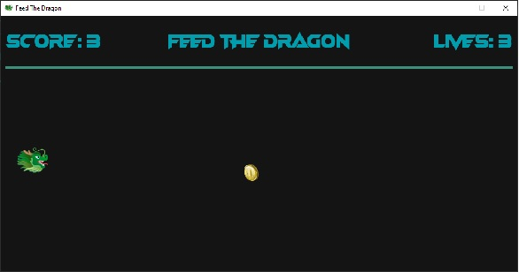

# Welcome to Feed The Dragon 🐲

This is a simple game made with pygame.

Player will move the dragon up or down to catch (eat) the coin. For each coin eaten, the player will be rewarded 1 score. But be careful, the higher the score the faster the coin can move.

For each coin missed, the player will be drawn 1 live. The player has 5 lives total. When the player has no lives left, a gameover screen will show up and ask player if they want to continue playing. Press Enter to play again, the score, lives and coin speed will be reset.

Enjoy gaming 🎮.
